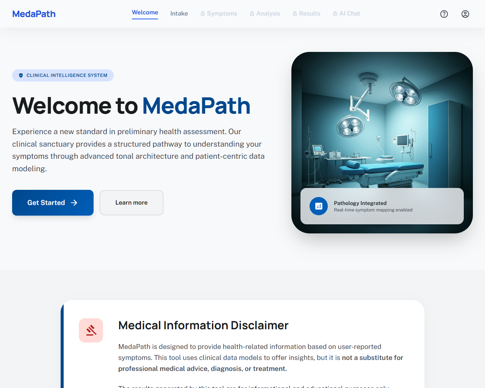
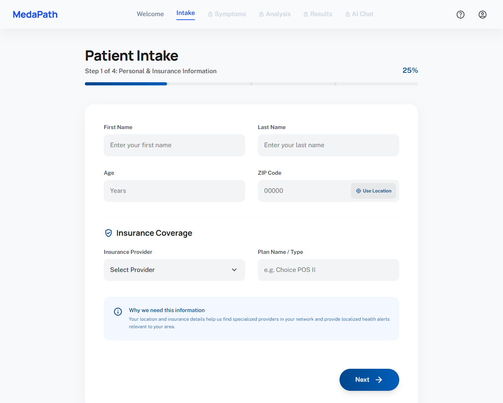
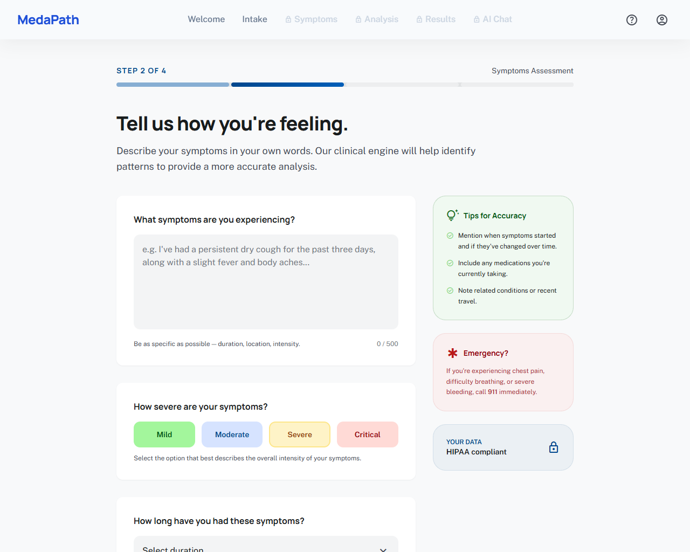
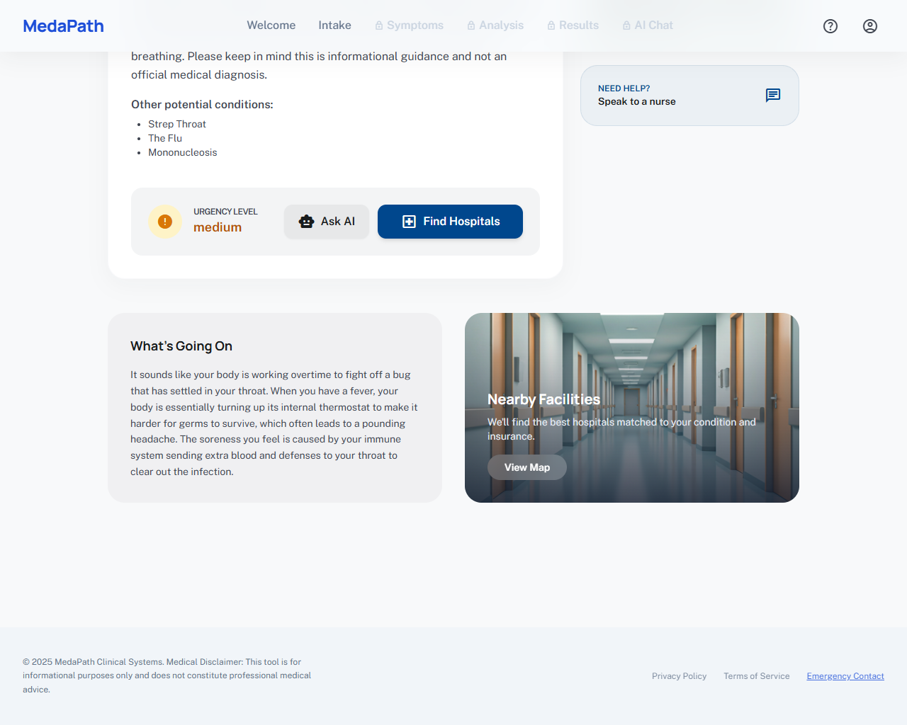
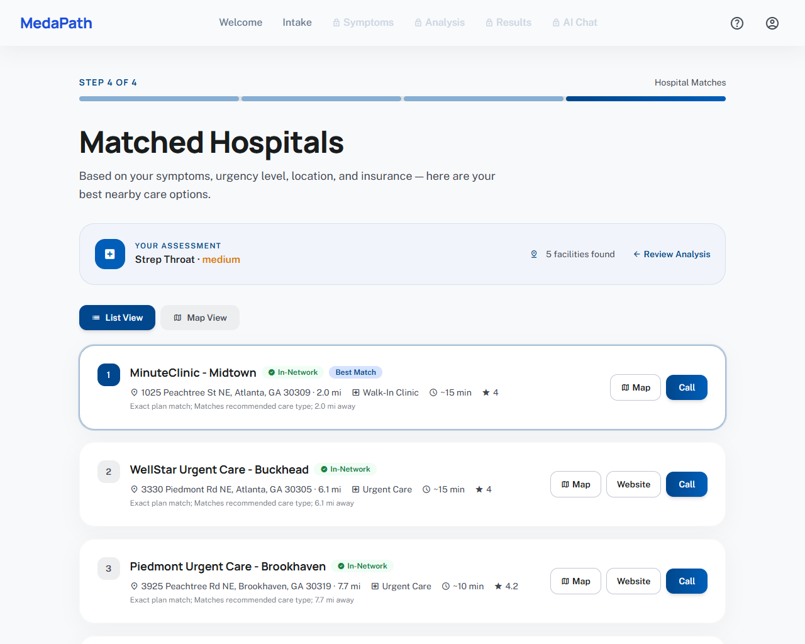
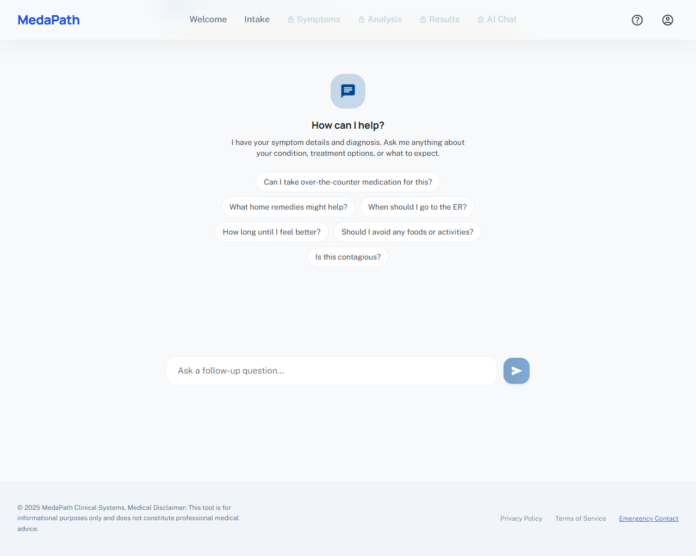

# MedaPath

**AI-Powered Healthcare Navigation**

MedaPath is an intelligent healthcare triage and navigation platform that helps patients understand their symptoms, find the right care, and make informed decisions — all powered by Google's Gemini AI.

Built for the hackathon by **Raphael Omorose** and **Uyiosa Nehikhuere**.

---

## What It Does

MedaPath guides patients through a seamless journey from symptom intake to finding the right hospital:

### 1. Patient Intake
Patients enter their personal information, ZIP code, and insurance details. The app auto-detects location using the Google Geocoding API to pre-fill the ZIP code, and presents a curated list of real insurance providers and plan names for accurate matching.

### 2. Symptom Assessment
Patients describe their symptoms in plain language, select severity and duration, and can optionally upload photos or videos of affected areas. Supported formats include JPG, PNG, GIF, WebP, MP4, MOV, and WebM — all sent securely to the AI for visual analysis.

### 3. AI-Powered Diagnosis
Google Gemini AI analyzes the patient's symptoms (and uploaded images) to provide:
- A **primary condition** identified in plain, easy-to-understand language
- **Three possible conditions** the symptoms could indicate
- An **urgency level** (low, medium, high, emergency)
- **Actionable advice** — what to do right now and when to see a doctor
- A **detailed explanation** of what's likely happening in the body, written as if explaining to a friend
- **Recommended care type** (Primary Care, Urgent Care, Emergency Room, or Specialist)

If Gemini is unavailable, a built-in keyword-based triage engine provides fallback analysis covering 12+ common conditions.

### 4. Hospital Matching
The platform finds the best nearby hospitals by combining:
- **Google Places API** to discover real hospitals near any ZIP code in the US
- **Insurance network matching** against a database of 15 Atlanta-area hospitals with detailed plan-level data
- **Smart scoring** that weighs insurance match, care type fit, distance, and emergency capability
- **Google Gemini AI coverage analysis** that evaluates whether each hospital is likely covered by the patient's specific insurance plan
- **Google Maps** for an interactive map view with custom markers, distance display, and one-click calling

### 5. Live AI Chat (Flagship Feature)
After receiving their diagnosis, patients can have a **real-time conversation with Gemini AI** to ask follow-up questions like:
- "Can I take ibuprofen with this?"
- "What home remedies might help?"
- "When should I go to the ER?"
- "Is this contagious?"

The AI assistant has full context of the patient's symptoms, diagnosis, and medical history from the session. It maintains multi-turn conversation history and provides warm, conversational responses while always reminding patients to seek professional medical advice.

### 6. Save & Download Reports
Patients can download a professionally formatted **Analysis Report** as a printable HTML document containing their full intake information, symptom details, AI diagnosis, urgency level, and care recommendations — perfect for sharing with a doctor at check-in.

---

## APIs & Services Used

| API / Service | How We Use It |
|---|---|
| **Google Gemini AI** (gemini-3-flash-preview) | Symptom analysis with image understanding, plain-language diagnosis, insurance coverage verification for hospitals, and live follow-up chat conversations |
| **Google Places API** | Real-time discovery of nearby hospitals for any ZIP code in the US, with ratings and open/closed status |
| **Google Geocoding API** | Converts ZIP codes to coordinates for distance calculations, and reverse-geocodes browser location to auto-fill ZIP |
| **Google Maps JavaScript API** | Interactive hospital map with custom SVG markers, user location dot, auto-fit bounds, and click-to-select |

---

## Screenshots

To add screenshots, save them in the `screenshots/` folder with these names:

| Page | Filename |
|---|---|
| Welcome Page | `screenshots/welcome.png` |
| Patient Intake | `screenshots/intake.png` |
| Symptom Assessment | `screenshots/symptoms.png` |
| AI Diagnosis | `screenshots/analysis.png` |
| Hospital Matches (Map) | `screenshots/results-map.png` |
| Hospital Matches (List) | `screenshots/results-list.png` |
| AI Chat | `screenshots/chat.png` |









---

## Tech Stack

**Frontend:** React, TypeScript, Vite, Tailwind CSS, React Router, Google Maps JavaScript API

**Backend:** Java 21, Spring Boot 4, Spring Data JPA, H2 Database, Google Gemini API, Google Places API, Google Geocoding API

---

## Getting Started

### Prerequisites
- Java 21
- Node.js 18+
- Google Cloud API keys with Gemini, Places, Geocoding, and Maps JavaScript APIs enabled

### Setup

1. Clone the repository
2. Create a `.env` file in the project root:
   ```
   GOOGLE_API_KEY=your_gemini_api_key
   GOOGLE_MAPS_API_KEY=your_maps_places_geocoding_api_key
   ```
3. Create a `.env` file in the `frontend/` directory:
   ```
   VITE_GOOGLE_MAPS_API_KEY=your_maps_api_key
   ```
4. Start the backend:
   ```bash
   cd backend
   ./mvnw spring-boot:run
   ```
5. Start the frontend:
   ```bash
   cd frontend
   npm install
   npm run dev
   ```
6. Open [http://localhost:5173](http://localhost:5173)

---

## Team

- **Raphael Omorose** - Backend Development
- **Uyiosa Nehikhuere** - Frontend Development

---

## Disclaimer

MedaPath is a hackathon project built for educational and demonstration purposes. It is **not** a medical device and should **not** be used for real medical decisions. Always consult a qualified healthcare provider for medical advice.
